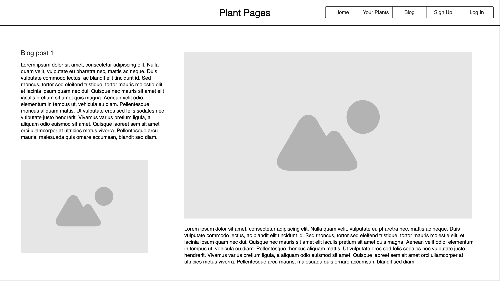
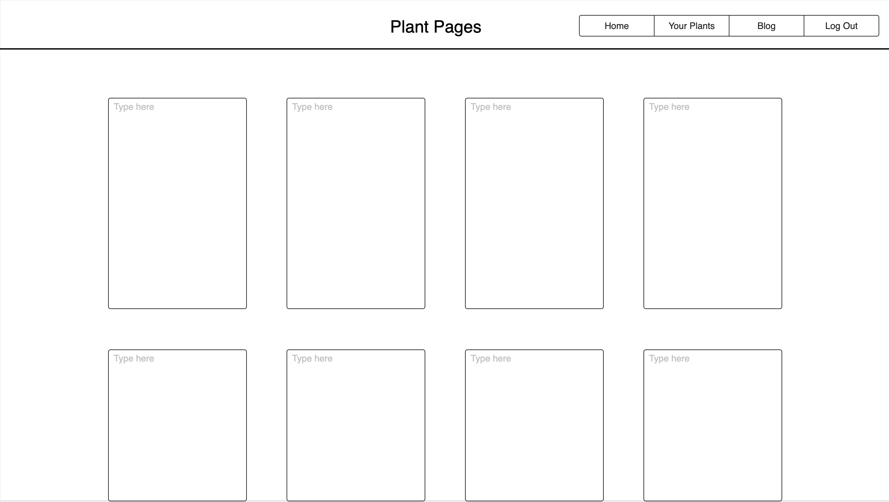
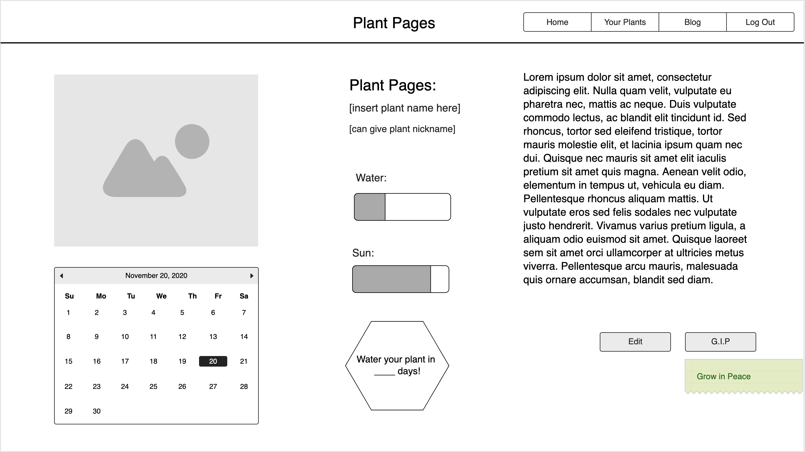

# Plant-Journal
Plant Log is an online application that lets the user document their plants and create notes for their individual care. 

## User Story
1. A user will be able to create entries on the plants they own, add their care needs. (They can also look at blog posts that other users make on plant topics.)
2. The user can sign in and be taken to their collection of plant "pages" 
3. They will be able to add a new plant with; name, water and sun needs, and a small snippet of their choosing. 
4. They can edit the plant details and delete if they choose, but they can also be put into a list of plants that didnt make it where they "Grow in Peace."
5. The G.i.P list can also be accessed by the user. 

## Wireframes

## Technologies Used
React, Express, CSS, Bootstrap

## Stretch Goals & Unsolved
* Adding authentication to users
* Creating blog posts
* Adding photo uploads

## Other
<a href="https://lovepik.com/images/png-leaves.html">Leaves Png vectors by Lovepik.com</a>